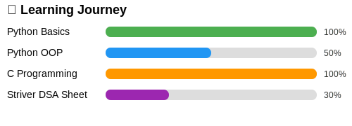

<!-- Header with animated wave -->

  

<h2 align="left"># Hi there! 👋 I'm Avinash</h2>

---

🎓 **BCA Student** | **Aspiring Software Engineer** | Python & DSA Learner  
I'm currently pursuing a Bachelor of Computer Applications (BCA) in Software Engineering. I'm passionate about learning Python, mastering Data Structures and Algorithms (via Striver DSA Sheet), and building clean, beginner-friendly code.  
🎯 *Goal:* Become a Software Engineer by 2027.

---

## 🚀 Tech Stack

  
  
  
  
  

---
## 🛠️ Favorite Tools

**Productivity & Coding:**

  
  
  
  
  
  

**VS Code Extensions:**  
`Python`, `Jupyter`, `Prettier`, `GitLens`, `Docker`, `Code Runner`, `Material Icon Theme`, `Better Comments`, `LeetCode`

---

---

## 💻 Featured Project

- 🐍 [100 Days of Python Challenge](https://github.com/AvinashNegi1999/100-Days-of-Python-Code-challenge) – My journey of daily Python learning with code, logic, and projects

---
👨‍💻 My portfolio is 

## 📢 Connect With Me

  
  
  
  
  
  
  
  

## 📊 GitHub & Coding Stats

<table style="border-collapse: collapse; width: 100%;">
  <tr>
    <td align="center" style="background: #FBFBFB; padding: 15px; border-radius: 8px;">
      <b style="color: #1B1433; font-family: Ubuntu, sans-serif;">LeetCode</b> 
      
    </td>
    <td align="center" style="background: #FBFBFB; padding: 15px; border-radius: 8px;">
      <b style="color: #1B1433; font-family: Ubuntu, sans-serif;">GitHub Stats</b> 
      
    </td>
  </tr>
  <tr>
    <td align="center" style="background: #FBFBFB; padding: 15px; border-radius: 8px;">
      <b style="color: #1B1433; font-family: Ubuntu, sans-serif;">GitHub Streak</b> 
      
    </td>
    <td align="center" style="background: #FBFBFB; padding: 15px; border-radius: 8px;">
      <b style="color: #1B1433; font-family: Ubuntu, sans-serif;">Top Languages</b> 
      
    </td>
  </tr>
</table>

<!-- 📈 GitHub Activity Graph -->

  <h2 align="center" style="color: #1B1433; font-family: 'Ubuntu', sans-serif; font-size: 22px; margin-bottom: 10px;">
    📈 GitHub Activity
  </h2>
  
  

<h2>My WakaTime Coding Activity</h2>

<!-- Visitor Counter -->

  

 
👨‍💻 My Coding Journey

I began my programming journey with **C** and **Python**, starting small with projects and problem-solving exercises. Over time I will focus on mastering **Data Structures & Algorithms** for technical interviews, diving into **Full-Stack Development** for end-to-end application building, and exploring **AI/ML** to create intelligent systems.

Currently, I’m documenting my progress through consistent GitHub commits and detailed Notion notes — transforming my skills from beginner-level to production-ready expertise. My learning philosophy is simple:  
**_Learn every day, build every week, improve every month._**

---

## 🎓 My Udemy Learning Wishlist

💡 **Note:** Udemy offers big discounts during sale events — best time to gift is during these sales!  

---

📚 <strong>Courses I'd Love to Learn</strong>

| Course | Link |
|--------|------|
| 🧠Linux Command Line – Volume 1 |  |
| ğŸ Python and Django Full Stack Bootcamp |  |
| 🨠Blender Tutorial |  |
| 📊 Data Structures & Algorithms in Python |  |
| 🖥 Complete Linux Training Course |  |
| ☁️ AWS Certified Cloud Practitioner – 2024 |  |
| ⛓ Build Your Own Blockchain from A–Z |  |
| 💻 The Complete JavaScript Course |  |

---

🎁 **How to gift:**  
- On Udemy, click **"Gift This Course"**.  
- Enter my email: **avinashnegi1999work@gmail.com**
  

---

<!-- Footer wave with quote -->

  

